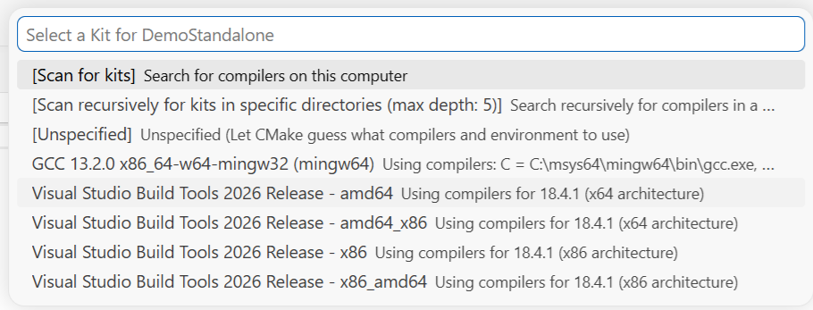
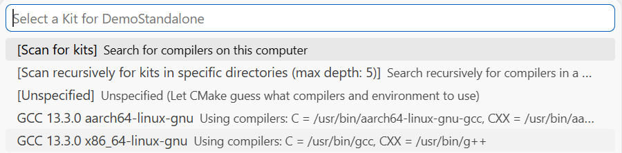
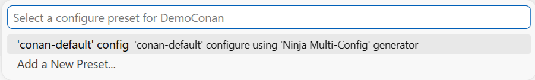
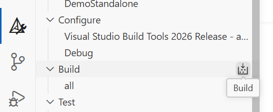
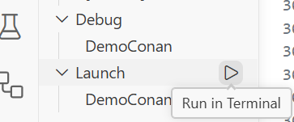
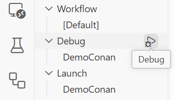
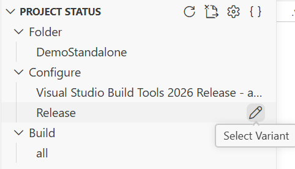
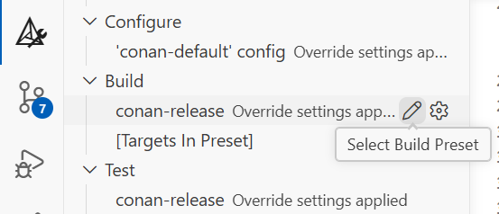

# Tutorial & Demo Project for modern cross-platform C/C++ application development with VS Code, CMake, Conan

This tutorial and included demo projects demonstrate how to get started with C/C++ application development using a modern set of tools based on:
- [Microsoft VS Code](https://code.visualstudio.com/) as IDE
- [CMake](https://cmake.org/) build system
- [Ninja](https://ninja-build.org/) (multi-config) build system backend
- [conan](https://conan.io/) package manager (optional)
- [GCC](https://gcc.gnu.org/) and [Microsoft MSVC ("CL")](https://learn.microsoft.com/en-us/cpp/build/reference/compiler-options) compiler

While these sophisticated tools provide good integration and fast workflows, the initial setup is somewhat involved and not very well documented. This tutorial aims to help with this.

This workflow works on Windows, Linux, and probably also mac OS (untested). It is mostly compiler-agnostic and can easily switch between different compilers where available. The created project immediately works on all platforms.

`conan` is a powerful package manager that allows you to efficiently use external libraries (which in turn may have further dependencies) in C/C++ applications in a cross-platform manner. It automatically chooses (and builds, if needed) the exact library needed for the particular platform and compiler. Enabling `conan` for a project is a little involved - this tutorial gives a quick start how to integrate `conan` with the given development environment.

This repository contains two demo projects that can be used as templates:
- `DemoStandalone` for configuring & building a project in VS Code with `CMake` but *without* `conan`, i.e. without using external library dependencies.
  - This is a very simple "hello world" project.
- `DemoConan` for configuring & building a project in VS Code with `CMake` and *with* `conan`, for using external library dependencies.
  - `DemoConan` uses the [GLFW](https://www.glfw.org/) [example code](https://github.com/glfw/glfw/blob/master/examples/triangle-opengl.c) to display a simple hardware-accelerated animation based on OpenGL.
  - Building cross-platform OpenGL-based applications used to require significant effort, but this development environment, particularly `conan`, makes it very easy - perfect for this example.


# Installation
These one-time instructions set up your development environment.

## Windows
### PowerShell
First, install the up-to-date version of powershell. Run powershell from the start menu **as administrator** and execute:
```powershell
winget install --id Microsoft.PowerShell --source winget
```
Close the powershell window, and search for `PowerShell 7` in the start menu, and run it **as administrator** to continue.

### MSVC Build tools
Then install the Visual Studio build tools which contain the compiler, build system (including `CMake` and `Ninja`) and Windows SDK:
```powershell
winget install --id Microsoft.VisualStudio.BuildTools --force --override "--wait --quiet --includeRecommended --add Microsoft.VisualStudio.Workload.VCTools"
```

For more information about this installation method, see the Microsoft documentation [here](https://learn.microsoft.com/en-us/visualstudio/install/use-command-line-parameters-to-install-visual-studio#use-winget-to-install-or-modify-visual-studio), [here](https://learn.microsoft.com/en-us/visualstudio/install/workload-and-component-ids) and [here](https://learn.microsoft.com/en-us/visualstudio/install/workload-component-id-vs-build-tools).

By default, you can't run the compiler directly from a command-prompt/powershell window because it needs some environment variables to be set. The installation automatically sets up a few shortcuts in the start menu for running a CMD or powershell window with the environment set, but none for using PowerShell with the compiler for 64bit.

Therefore, open any folder (e.g. Desktop) in Windows Explorer, right-click, select `New` → `Shortcut`. As the location, enter this path:
```
pwsh.exe -noe -c "& 'C:\Program Files (x86)\Microsoft Visual Studio\18\BuildTools\Common7\Tools\Launch-VsDevShell.ps1' -Arch amd64 -HostArch amd64"
```
and click `Next`. As the name for the shortcut, choose e.g. `AMD64 Developer PowerShell`.

Repeat this process with the path
```
pwsh.exe -noe -c "& 'C:\Program Files (x86)\Microsoft Visual Studio\18\BuildTools\Common7\Tools\Launch-VsDevShell.ps1' -Arch x86 -HostArch amd64"
```
and the name `x86 Developer PowerShell`. Optionally pin these shortcuts to the start menu. Now, when you run these shortcuts, you'll get a powershell window (running the latest powershell version) where you can run the build tools and compiler for AMD64/x86.

### Git
The `git` version control system is not strictly required for this workflow, but still very useful in general, even if just to download this repository. Install it by running (still in administrator power shell)
```powershell
winget install --id Git.Git -e --source winget
```

By default `git` on Windows converts line endings from Windows style (cr-lf) to Unix/Linux style (lf) when committing. In my opinion this causes needless confusion, particularly also with automatically generated text files (though this repository uses none). Therefore I'd recommend *disabling* `git`'s automatic line-ending conversion right after installation, before working on any repositories. To do this, run this command on a **user** (not administrator) powershell:
```powershell
git config --global "core.autocrlf" false
```

### Python
Then, install python which is needed for the `conan` package manager. This can be done mostly automatically. Run this in a powershell window (as administrator) for the basic Python installation:

```powershell
winget install Python.PythonInstallManager --accept-package-agreements --disable-interactivity
pymanager install --configure -y
```
Now close the window and open it again (still as administrator) to re-load the environment variables.
### Conan
Install the `conan` package manager:
```powershell
python -m pip install -U pip conan
pymanager install --refresh
```
Close the administrator powershell window. Open a powershell window **without administrator** and setup the conan default profile:
```powershell
conan profile detect
```
This should print something like:
```
detect_api: Found msvc 18

Detected profile:
[settings]
arch=x86_64
build_type=Release
compiler=msvc
compiler.cppstd=14
compiler.runtime=dynamic
compiler.version=195
os=Windows

WARN: This profile is a guess of your environment, please check it.
WARN: The output of this command is not guaranteed to be stable and can change in future Conan versions.
WARN: Use your own profile files for stability.
Saving detected profile to C:\Users\…\.conan2\profiles\default
```

### Verify
Open the previously created shortcut for `AMD64 Developer PowerShell` and use `Get-Command` to verify that all tools are available:
```powershell
Get-Command -Name cmake,ninja,python,conan,cl
```
this should print something like:
```
Application cmake.exe  4.2.3.0    C:\Program Files (x86)\Microsoft Visual Studio\18\BuildTools\Common7\IDE\CommonExtensions\Microsoft\CMake\CMake\bin\cmake.exe
Application ninja.exe  0.0.0.0    C:\Program Files (x86)\Microsoft Visual Studio\18\BuildTools\Common7\IDE\CommonExtensions\Microsoft\CMake\Ninja\ninja.exe
Application python.exe 0.0.0.0    C:\Users\…\AppData\Local\Microsoft\WindowsApps\python.exe
Application conan.exe  0.0.0.0    C:\Users\…\AppData\Local\Python\bin\conan.exe
Application cl.exe     14.50.357… C:\Program Files (x86)\Microsoft Visual Studio\18\BuildTools\VC\Tools\MSVC\14.50.35717\bin\HostX64\x64\cl.exe
Application git.exe    2.53.0.2   C:\Program Files\Git\cmd\git.exe
```
Verify that you're running at least `conan` version `2.26.2`:
```sh
conan --version
```

Continue with the [Common Setup](#common-linux--windows) below.

## Linux (Debian/Ubuntu)
### Base Setup
First, install all necessary tools:
```sh
sudo apt-get install -y --no-install-recommends gcc g++ ninja-build cmake make gdb python3 python3-pip
```
### Conan
Install the `conan` package manager:
```sh
sudo python3 -m pip install --break-system-packages conan
```

Setup the conan default profile:

```sh
conan profile detect
```
This should print something like:
```
detect_api: Found cc=gcc-13.3.0
detect_api: gcc>=5, using the major as version
detect_api: gcc C++ standard library: libstdc++11

Detected profile:
[settings]
arch=x86_64
build_type=Release
compiler=gcc
compiler.cppstd=gnu17
compiler.libcxx=libstdc++11
compiler.version=13
os=Linux

WARN: This profile is a guess of your environment, please check it.
WARN: The output of this command is not guaranteed to be stable and can change in future Conan versions.
WARN: Use your own profile files for stability.
Saving detected profile to /home/…/.conan2/profiles/default
```
### Verify
Verify that all tools are available:
```sh
which cmake make ninja python conan gcc g++ gdb git
```
this should print something like:
```
/usr/bin/cmake
/usr/bin/make
/usr/bin/ninja
/usr/local/bin/conan
/usr/bin/gcc
/usr/bin/g++
/usr/bin/gdb
/usr/bin/git
```

Verify that you're running at least `conan` version `2.26.2`:
```sh
conan --version
```
Continue with the [Common Setup](#common-linux--windows) below.

## Common (Linux + Windows)
### Git Configuration
Optionally configure your name and e-mail address in `git`, as you will need to do this before committing to any `git` repository (on Windows, run this in a non-administrator powershell window):

```sh
git config --global user.name "John Doe"
git config --global user.email johndoe@example.com
```

`git` is a very powerful source code and version management tool. Particularly it allows you to experiment with your project while always being able to go back to a previous working state. Installation instructions for `git` are given here for the sake of a complete setup, but detailed use instructions are beyond the scope of this tutorial. You can find plenty of information online.


### VS Code installation
- [Install VS Code](https://code.visualstudio.com/docs/setup/setup-overview) as per Microsoft's instructions.
- Install the following extensions in VS Code:
  - [C/C++ Tools](https://marketplace.visualstudio.com/items?itemName=ms-vscode.cpptools)
  - [CMake Tools](https://marketplace.visualstudio.com/items?itemName=ms-vscode.cmake-tools) (ignore the instructions regarding "Ensure CMake is available on your system." - we already installed it previously)

# Working on a project
After installing all the needed tools, you can finally start working on a project in VS Code.

VS Code offers no direct way of starting a fully-working project "from scratch". A few things need to be configured for a working project setup. Even though only a few files are needed for this, it's easiest to just use the demo projects in this repository as a template.

The further workflows below will generate a `build` directory in the respective project directory that contains all generated files, including the final executable.
- **Note**: Never manually modify any files within the `build` directory, as they will be overwritten or removed by the various tools.
- **Don't** copy the `build` directory to other computers / installed OSes. Don't even keep the `build` directory when moving your project to a different location on the same system. This is because the various build tools save the current absolute path of your project and contained files in the various generated files in the `build` directory - those will be inconsistent after moving the project.
- When moving the project to a different directory or computer, always **delete** the `build` directory first.
- When working with `git`, add the `build` directory ot the `.gitignore` file, such that when cloning the repository, the `build` directory will be skipped.
- If troubles during project configuration/building arise, first delete the `build` directory and start from scratch (see below).

## Project Import

To use the demo projects, download this repository through git:
```sh
git clone https://github.com/Erlkoenig90/VSCodeCMakeDemo.git
```
If you prefer, you can also just download it as a [ZIP archive](https://github.com/Erlkoenig90/VSCodeCMakeDemo/archive/refs/heads/main.zip) and extract it.

## Using `DemoStandalone` project

This project demonstrates setting up a simple project without `conan` and without external libraries, i.e. just a bare C or C++ project but using CMake and VS Code as build tools. In VS Code, we will select a *kit*, which defines a compiler toolchain to use for building the project.

### Opening project in VS Code

In VS Code, first open the command palette (`Ctrl-Shift-P`) and select `CMake: Scan for Kits`. This command probably has no immediately visible effect.

Click `File` → `Open Folder` and pick the `DemoStandalone` directory.

VS Code will probably immediately ask you to pick a `kit` for the project. If not, open the command palette (`Ctrl-Shift-P`) and select `CMake: Select a Kit`. This will open a menu to choose the desired compiler toolchain to use for this project. Which one is appropriate depends on your system setup.

- On Windows, choose `Visual Studio Build Tools 2026 Release - amd64`



- On Ubuntu/Debian, choose `GCC 13.3.0 x86_64-linux-gnu`



The exact version may be different, and multiple versions may be installed.

In the `Output` panel, there should be an output like this:

```
[proc] Executing command: "C:\Program Files (x86)\Microsoft Visual Studio\18\BuildTools\Common7\IDE\CommonExtensions\Microsoft\CMake\CMake\bin\cmake.exe" -DCMAKE_EXPORT_COMPILE_COMMANDS:BOOL=TRUE --no-warn-unused-cli -S C:/Users/…/DemoStandalone -B c:/Users/…/DemoStandalone/build -G "Ninja Multi-Config"
[cmake] Not searching for unused variables given on the command line.
[cmake] -- The C compiler identification is MSVC 19.50.35727.0
[cmake] -- The CXX compiler identification is MSVC 19.50.35727.0
… more text …
[cmake] -- Generating done (0.0s)
[cmake] -- Build files have been written to: C:/Users/…/DemoStandalone/build
```

The details differ depending on platform. Check that `Build files have been written` is printed.

Continue with [Building project](#building-project) below.

## Using `DemoConan` project

This project demonstrates setting up a project with `conan` to be able to use external libraries as dependencies.

The selection of compiler toolchain works differently to the standalone project above: `conan` automatically chooses the compiler according to its *profile*, which was previously generated in the `~/.conan2/profiles/default` file. It is important that the project uses the exact same compiler as `conan` used for choosing/building the dependency libraries, therefore we only have to tell VS Code / `CMake` to use `conan`s own preference. This happens via a *preset*, see below.

### Dependency installation / configuration with `conan`

**Before** opening the `DemoConan` project in VS Code follow these steps. On Windows, open a Developer Shell by running the previously created `AMD64 Developer PowerShell` shortcut. On Linux, simply run a terminal. Change to you project directory, and run:

```sh
conan install . -s build_type=Debug -c 'tools.cmake.cmaketoolchain:generator=Ninja Multi-Config' -c 'tools.cmake.cmakedeps:new=will_break_next' --build=missing --deployer=runtime_deploy --deployer-folder 'build/Debug' -c tools.system.package_manager:mode=install -c tools.system.package_manager:sudo=True -c 'tools.env:dotenv=True'
conan install . -s build_type=Release -c 'tools.cmake.cmaketoolchain:generator=Ninja Multi-Config' -c 'tools.cmake.cmakedeps:new=will_break_next' --build=missing --deployer=runtime_deploy --deployer-folder 'build/Release' -c tools.system.package_manager:mode=install -c tools.system.package_manager:sudo=True -c 'tools.env:dotenv=True'
```

The command `conan install` is slightly mis-named; it actually *configures* your project to use the globally installed dependencies of the project. If they aren't installed yet, they will be installed *once* (and built) if necessary, though. The dependency libraries will be installed per user, in `~/.conan2` / `$env:USERPROFILE\.conan2`. `conan` generates several files in the `build` directory that allow `CMake` to find these libraries. We are using *two* invocations of `conan install` to get the libraries for both `Debug` and `Release` configurations.

For this particular demo project, on Linux these commands will also install system-wide dependencies using the system package manager (e.g. `apt-get`). The project depends on OpenGL for which `conan` installs the necessary system packages. The options `-c tools.system.package_manager:mode=install -c tools.system.package_manager:sudo=True` enable this `conan` feature; they can be omitted for most projects.

- **Note**: After deleting the `build` directory, you will have to **re-run** the above `conan install` commands.

The demo project also contains a configured task to run `conan install` - after opening the project in VS Code (see below), you can then also perform this action by selecting `Tasks: Run Task` from the command palette (`Ctrl-Shift-P`) and clicking `Configure conan dependencies`. However this does not always work reliably from within VS Code, and it's usually better to manually run `conan install` *before* opening the folder in VS Code.

### Opening project in VS Code

In VS Code, click `File` → `Open Folder` and pick the `DemoConan` directory.

VS Code will probably immediately ask you to pick a `configure preset` for the project. If not, open the command palette (`Ctrl-Shift-P`) and select `CMake: Select Configure Preset`.

This will open a menu that should have only one entry:

- Choose the single `conan-default` preset.



In the `Output` panel, there should be an output like this:

```
[proc] Executing command: "C:\Program Files (x86)\Microsoft Visual Studio\18\BuildTools\Common7\IDE\CommonExtensions\Microsoft\CMake\CMake\bin\cmake.exe" -DCMAKE_POLICY_DEFAULT_CMP0091=NEW -DCMAKE_C_COMPILER=cl -DCMAKE_CXX_COMPILER=cl -DCMAKE_TOOLCHAIN_FILE=generators/conan_toolchain.cmake -S C:/Users/…/DemoConan -B C:/Users/…/DemoConan/build -G "Ninja Multi-Config"
[cmake] -- Using Conan toolchain: C:/Users/…/DemoConan/build/generators/conan_toolchain.cmake
[cmake] -- Conan toolchain: Setting CMAKE_MSVC_RUNTIME_LIBRARY=$<$<CONFIG:Debug>:MultiThreadedDebugDLL>$<$<CONFIG:Release>:MultiThreadedDLL>
[cmake] -- Conan toolchain: C++ Standard 14 with extensions OFF
[cmake] -- Conan toolchain: Including CMakeDeps generated conan_cmakedeps_paths.cmake
[cmake] -- The C compiler identification is MSVC 19.50.35727.0
[cmake] -- The CXX compiler identification is MSVC 19.50.35727.0
… more text …
[cmake] -- Generating done (0.0s)
[cmake] -- Build files have been written to: C:/Users/…/DemoConan/build
```

The details differ depending on platform. Check that `Build files have been written` is printed.

Continue with [Building project](#building-project) below.

## Building project

After the project has been configured by choosing a *kit* or *preset*, you can now finally compile the source code. This is done by any one of the following methods:
- Select `CMake: Build` from the command palette (`Ctrl-Shift-P`)
- Use the `Build` button in the `CMake` bar.



- The `F7` hotkey

## Running the application

Running the application from within VS Code is somewhat counterintuitive. First make sure the correct launch target is selected in the `Launch` field in the `CMake` bar. Usually there is only one, and the name is the one passed to `add_executable` in your `CMakeLists.txt`.

Then launch the executable using one of these methods:
- Select `CMake: Run Without Debugging` from the command palette (`Ctrl-Shift-P`)
- Use the `Run in Terminal` button in the `CMake` bar.



- The `Ctrl-Shift-F5` hotkey

It is *not necessary* to add a launch/debug configuration through the `run and debug` menu or the `.vscode/launch.json` file. The `CMake` extension automatically launches the application correctly without additional configuration. Adding a launch configuration via `launch.json` does work in general but can cause confusion particularly when porting the project to another computer or operating system.

## Debugging the application

Debugging happens in almost the same way as just launching the application. Again make sure the correct launch target is selected, but this time in the `Debug` field in the `CMake` bar.

The commands to start debugging are:
- Select `CMake: Debug` from the command palette (`Ctrl-Shift-P`)
- Use the `Debug` button in the `CMake` bar.



- The `Shift-F5` hotkey

Again, it is *not necessary* to add a debug configuration through the `.vscode/launch.json` file.

# Further topics

## Project name

The `CMakeLists.txt` file configures most of the project setup. The project name is given through the `project` line:

```cmake
project("DemoConan")
```

The rest of the files uses this name through `${PROJECT_NAME}`, so you can adjust the name by modifying this single line.

## Adding source files

The `CMakeLists.txt` also declares the list of source files to compile. The list of source files is given via `target_sources`. Add more files to that line as needed:

```cmake
target_sources(${PROJECT_NAME} PRIVATE "main.c" "util.c")
```

## Build Configurations

The application can be compiled in different build configurations, most importantly `Debug` and `Release`. With `Debug`, optimizations are disabled and some more strict tests are enabled in the standard library, while `Release` enables compiler optimizations. Traditionally, `CMake` needed to generate an individual `build` directory per build configuration which makes switching between those slow and cumbersome. Instead this project uses the `Ninja Multi-Config` generator which means that `CMake` generates and handles all configurations in a single directory through a single workflow.

The application's executable files will be generated in `build/Debug` and `build/Release`.

Choosing the build configuration is slightly different for the `DemoConan` (which uses presets) and the `DemoStandalone` (which doesn't use presets):
- For `DemoStandalone`, use the `Select Variant` button:



- For `DemoConan`, use the `Select Build Preset` button:



When you then build and run your application, the appropriate build configuration will be used.

## Using libraries/dependencies with `conan`

In a `conan`-based project like `DemoConan`, the `conanfile.txt` file declares the project's dependencies. The `DemoConan` project depends on `GLFW` and two helper libraries. The file contains a few further settings to tell `conan` how to output the dependency configuration. See the [conanfile.txt](https://docs.conan.io/2/reference/conanfile_txt.html) documentation.

To add more libraries as dependencies to your project, search the [Conan Center](https://conan.io/center) for available packages (called "recipes") - for example, see the [page for the zlib recipe](https://conan.io/center/recipes/zlib?version=1.3.1). On each recipe's page you can find a pre-made snippet to add to the `conanfile.txt`.

**Note**: This snipped also contains a line with `CMakeDeps` in the `[generators]` section. **Don't** add `CMakeDeps` to your `conanfile.txt`, as this generator has some deficiencies that can cause problems in combination with VS Code and recent `CMake` versions. The demo project instead uses `CMakeConfigDeps` which supersedes `CMakeDeps`. For adding e.g. `zlib`, *only* add the line `zlib/1.3.1` to your `conanfile.txt`.

After modifying `conanfile.txt`, re-run the `conan install` command from above. This will also print an instruction like this:
```
conanfile.txt: CMakeDeps necessary find_package() and targets for your CMakeLists.txt
    find_package(glfw3)
    find_package(glad)
    find_package(linmath.h)
    find_package(ZLIB)
    target_link_libraries(... glfw glad::glad linmath.h::linmath.h ZLIB::ZLIB)
```

These commands (`find_package` and `target_link_libraries`) need to be added to the `CMakeLists.txt` to allow the application to find those dependencies. In the demo project, this is already done for `glfw3`, `glad` and `linmath.h`. Assuming that you are adding `zlib` as a new dependency make these adjustments to the `CMakeLists.txt`:
- Add the line `find_package(ZLIB)`
- Append `ZLIB::ZLIB` to the line containing `target_link_libraries`, e.g.:
```cmake
target_link_libraries(${PROJECT_NAME} glfw glad::glad linmath.h::linmath.h ZLIB::ZLIB)
```

Then, add the needed includes (e.g. `#include "zlib.h`") to the C/C++ source code and call the library's functions.

Now you can re-build the project in VS Code with using the newly added library.

## Shared Libraries

By default, `conan` links most libraries statically, i.e. the library's code will be integrated in your application's executable file. This makes distribution easier but also means the file will be large and you can't easily upgrade a library. There might also be licensing problems, e.g. LGPL-licensed libraries need to be linked as external files if your application is not open-source.

To link all libraries dynamically, add an `options` section to your `conanfile.txt` as follows:
```ini
[options]
*/*:shared=True
```

To only link a specific library dynamically, specify it as
```ini
[options]
glfw/*:shared=True
```

Re-Run `conan install` as above to apply these changes. The `--deployer` command line option as shown above will make sure the dynamic libraries (`.dll`, `.so`, `.dylib`) will be copied into the `build` directory such that the application can run.

## Building via command line

One of the advantages of using `CMake` is that the projects can also easily be built on the command line, by calling `CMake` directly. On Windows, run the following commands in a Developer Shell by running the previously created `AMD64 Developer PowerShell` shortcut. On Linux, simply run a terminal.

### For standalone project

- In the project directory, run `CMake` to generate the project's build system:
```sh
cmake -S . -B build -G "Ninja Multi-Config"
```
- To compile the project, run:
```sh
cmake --build build --config Debug
```
or
```sh
cmake --build build --config Release
```

If you wish to use a different compiler than the automatically detected one, you can specify it on the first call to `CMake`:

```sh
cmake -S . -B build -G "Ninja Multi-Config" -DCMAKE_C_COMPILER=gcc -DCMAKE_CXX_COMPILER=g++
```


### For `conan`-based project

- For `conan`-based projects, the call to `conan install` as before is needed here as well

- In the project directory, run `CMake` with the preset to generate the project's build system:
```sh
cmake -S . -B build --preset conan-default -G "Ninja Multi-Config"
```
- To compile the project, run:
```sh
cmake --build build --preset conan-debug
```
or
```sh
cmake --build build --preset conan-release
```

## Cross-Compiling Linux → Windows

With the given setup, it is easy to compile applications for a different platform, also including using libraries for that target platform - this used to be very difficult. Since the number of possible combinations for current and target system is very large, we'll focus here on the pretty common case of building Windows applications on Linux.

Before continuing, delete the project's current `build` directory to avoid clashes between the old and new compiler selection.

First, install MinGW, a GCC compiler that generates Windows executables (`.exe`) but which itself can run on both Windows and Linux:
```sh
sudo apt install g++-mingw-w64-x86-64 gcc-mingw-w64-x86-64
```

Then create a `conan` profile, i.e. a text file that tells `conan` about this new compiler. Create a text file `~/.conan2/profiles/x86_64-w64-mingw32` with the following content:
```
[settings]
arch=x86_64
build_type=Release
compiler=gcc
compiler.cppstd=gnu17
compiler.libcxx=libstdc++11
compiler.version=13
os=Windows

[conf]
tools.build:compiler_executables={"c":"x86_64-w64-mingw32-gcc","cpp":"x86_64-w64-mingw32-g++","rc":"x86_64-w64-mingw32-windres"}
```

Adjust the exact compiler name and version as needed.

Then, in VS Code, re-run the `CMake: Scan for Kits` action from the command palette.

### For standalone project

After opening a standalone project in VS Code, run the `CMake: Select a Kit` action, select `GCC 13-win32 x86_64-w64-mingw32` (or similar) and build the project as before.

If you wish to build via command line, specify the compiler to the initial call to `CMake`:
- In the project directory, run `CMake` to generate the project's build system:
```sh
cmake -S . -B build -G "Ninja Multi-Config" -DCMAKE_C_COMPILER=x86_64-w64-mingw32-gcc -DCMAKE_CXX_COMPILER=x86_64-w64-mingw32-g++
```
and build as before.

### For `conan`-based project

Re-Run the `conan install` commands from above, but add the option `-pr:h x86_64-w64-mingw32` which tells `conan` to use the newly created profile, i.e.:

```sh
conan install . -s build_type=Debug -c "tools.cmake.cmaketoolchain:generator=Ninja Multi-Config" -c 'tools.cmake.cmakedeps:new=will_break_next' --build=missing --deployer=runtime_deploy --deployer-folder "build/Debug" -pr:h x86_64-w64-mingw32
conan install . -s build_type=Release -c "tools.cmake.cmaketoolchain:generator=Ninja Multi-Config" -c 'tools.cmake.cmakedeps:new=will_break_next' --build=missing --deployer=runtime_deploy --deployer-folder "build/Release" -pr:h x86_64-w64-mingw32
```

Then you can build the project as before.

## Distributing the application

When you are ready to ship your application, you can uses `CMake`s "install" feature. This will not actually install the application on your system, but copy the project's executable(s) into a target directory. You can then pack this directory e.g. as a `zip` archive for distribution. Use this command to generate a directory with the distributable application and dynamic libraries:

```sh
cmake --install build --config Release --prefix inst
```

And redistribute the `inst` directory.

## Building in CI via GitHub Actions

Both demo projects can be built fully automatically on the GitHub cloud-based servers through [GitHub Actions](https://github.com/features/actions). This is configured through the `.github/workflows/build.yml` file, no further actions are needed.

As soon as a new commit for the project is pushed to the GitHub repository or a fork, both demo projects are automatically compiled for Windows, Linux and Mac OS. The resulting binaries can then be downloaded through the GitHub Web UI. Any compilation errors are reported automatically.

You can see the [results for this repository here](https://github.com/Erlkoenig90/VSCodeCMakeDemo/actions/workflows/build.yml).
